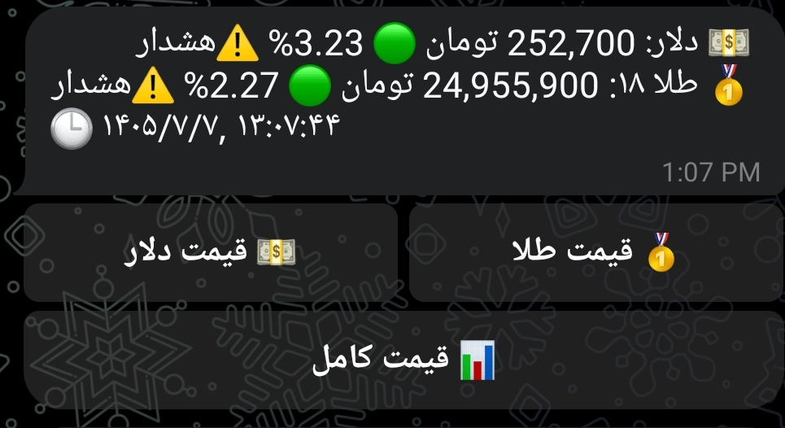
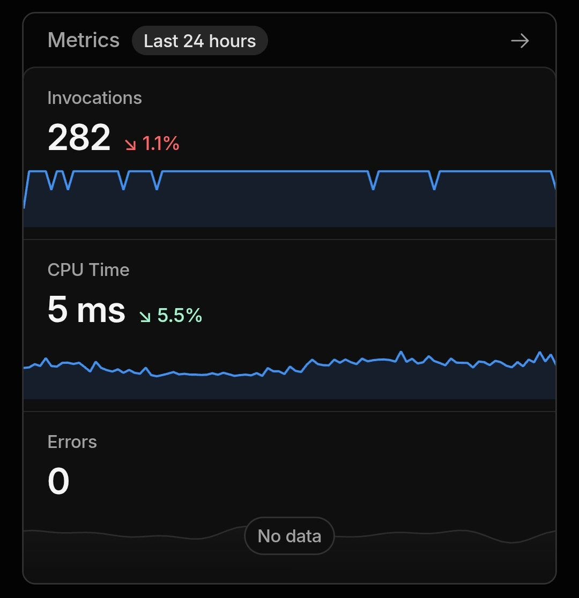

<div align="center">

# 💵 TGJU Telegram Price Bot

### ربات تلگرام قیمت لحظه‌ای دلار و طلا

[](https://workers.cloudflare.com/)
[](https://core.telegram.org/bots)
[](https://developer.mozilla.org/docs/Web/JavaScript)
[](https://opensource.org/licenses/MIT)
[](http://makeapullrequest.com)
[](#-دموی-زنده)
[](#)

**Live USD & Gold prices for the Iranian market — serverless, free, zero-maintenance.**
**قیمت لحظه‌ای دلار و طلا برای بازار ایران — بدون سرور، رایگان، بدون نگهداری.**

[ویژگی‌ها](#-ویژگیها) • [دموی زنده](#-دموی-زنده) • [نصب](#-نصب-و-راهاندازی) • [معماری](#-معماری-پروژه) • [داستان ساخت](#-داستان-ساخت--انسان--هوش-مصنوعی)

</div>

---

## 🎯 این پروژه چیه؟

یه ربات تلگرام سبک و سریع که قیمت لحظه‌ای **دلار آزاد** و **طلای ۱۸ عیار** رو از [TGJU](https://www.tgju.org) می‌گیره و با دکمه‌های شیشه‌ای به کاربر نشون می‌ده. همه چیز روی **Cloudflare Workers** اجرا می‌شه — بدون نیاز به سرور، VPS، یا حتی یه خط کد پایتون.

**بیش از ۱۰ روزه که بدون وقفه در حال کاره.** ⚡

### What is this?

A lightweight Telegram bot that pulls live **USD** and **18K Gold** prices from TGJU for the Iranian market — with inline keyboard buttons, auto-updates via Cron, and zero server management. Runs entirely on Cloudflare's free tier.

---

## 🌐 دموی زنده

**آدرس Worker:** [`https://price-bot.nyqfvqaoivkpvq0ndd1r8if.workers.dev`](https://price-bot.nyqfvqaoivkpvq0ndd1r8if.workers.dev)

| Endpoint | توضیح |
|----------|-------|
| `/` | بررسی فعال بودن ربات |
| `/test` | نمایش JSON قیمت‌های لحظه‌ای (برای دیباگ) |
| `/setup` | تنظیم Webhook تلگرام (یک بار) |
| `/webhook` | دریافت پیام‌های تلگرام (خودکار) |

---

## ✨ ویژگی‌ها

- 💵 **قیمت لحظه‌ای دلار آزاد** (منبع: TGJU)
- 🥇 **قیمت لحظه‌ای طلای ۱۸ عیار** (به تومان، هر گرم)
- ⌨️ **دکمه‌های شیشه‌ای** — بدون تایپ، فقط لمس کن
- ⏱ **به‌روزرسانی خودکار هر ۵ دقیقه** (فقط وقتی قیمت تغییر کنه)
- 🔕 **ضد اسپم** — پیام تکراری نمی‌فرسته
- ⚠️ **هشدار نوسان** — اگه نوسان روزانه بیشتر از ۲٪ بشه
- 🌐 **پشتیبانی از دستورات فارسی و انگلیسی**
- 🆓 **کاملاً رایگان** — روی پلن رایگان Cloudflare
- 🔒 **بدون کلید API از TGJU** — از endpoint عمومی استفاده می‌کنه
- 🕒 **ساعت درست ایران** — بدون مشکل daylight saving
- 📊 **لیست کاربران** — دستور `/users` فقط برای ادمین
- 💾 **ذخیره‌سازی بهینه** — KV write فقط وقتی اطلاعات تغییر کنه
- 🔄 **Fallback خودکار** — اگه سرور TGJU قطع شد، سراغ آینه بعدی می‌ره
- 🚫 **ضد کش** — با cache-buster، همیشه قیمت تازه می‌گیره

---

## 📸 اسکرین‌شات‌ها

<div align="center">

### 💬 چت ربات در تلگرام


### ⌨️ دکمه‌های شیشه‌ای


### ☁️ داشبورد Cloudflare


</div>

### نمونه خروجی پیام

```
┌────────────────────────────────────────┐
│  💵 دلار: 243,800 تومان 🟢 3.74%       │
│  🥇 طلا ۱۸: 24,443,400 تومان 🟢 2.27% ⚠️ │
│  🕒 ۱۴۰۵/۷/۷، ۱۲:۳۰:۰۰                │
│                                        │
│  [💵 قیمت دلار] [🥇 قیمت طلا]          │
│  [      📊 قیمت کامل      ]            │
└────────────────────────────────────────┘
```

> ⚠️ وقتی نوسان روزانه از ۲٪ بگذره، این علامت به پیام اضافه می‌شه.

---

## 🧠 معماری پروژه

```
┌───────────┐     ┌─────────────────────┐     ┌──────────┐
│           │     │                     │     │          │
│   User    │────▶│  Cloudflare Worker  │────▶│   TGJU   │
│ (Telegram)│◀────│    (JavaScript)     │◀────│   API    │
│           │     │                     │     │          │
└───────────┘     └──────────┬──────────┘     └──────────┘
                             │
                             │ Cron هر ۵ دقیقه
                             ▼
                      ┌──────────────┐
                      │  KV Storage  │
                      │  (کاربران +  │
                      │   آخرین قیمت)│
                      └──────────────┘
```

### جریان داده

1. **کاربر** به ربات پیام می‌ده یا دکمه می‌زنه.
2. **تلگرام** پیام رو به `/webhook` می‌فرسته.
3. **Worker** قیمت رو از TGJU می‌گیره.
4. **Worker** پاسخ رو به تلگرام برمی‌گردونه.
5. **Cron** هر ۵ دقیقه: قیمت جدید می‌گیره، اگه تغییر کرده بود به همه کاربران پیام می‌فرسته.

### چرا Cloudflare Workers؟

| مزیت | توضیح |
|------|-------|
| 🆓 **رایگان** | ۱۰۰,۰۰۰ درخواست در روز بدون هیچ هزینه‌ای |
| 🌍 **Edge Computing** | کد نزدیک کاربر اجرا می‌شه → سریع‌تر |
| 🔧 **بدون سرور** | نه نصب، نه نگهداری، نه نگرانی از crash |
| ⏰ **Cron Triggers** | به‌روزرسانی خودکار بدون سرویس خارجی |
| 🔐 **HTTPS رایگان** | SSL خودکار |
| 🚀 **Deploy در ۲ دقیقه** | فقط کپی پیست و یه کلیک |
| 📊 **Observability** | لاگ‌های زنده و مانیتورینگ کامل |

---

## 🚀 نصب و راه‌اندازی

### پیش‌نیازها

- حساب [Telegram](https://telegram.org) (برای ساخت ربات)
- حساب رایگان [Cloudflare](https://dash.cloudflare.com/sign-up)
- یه مرورگر (همه کارها از داشبورد Cloudflare انجام می‌شه — **نیازی به نصب چیزی نیست**)

> 💡 این پروژه حتی از روی موبایل هم می‌تونه Deploy بشه. نیازی به لپ‌تاپ یا Node.js نداری.

### مرحله ۱ — ساخت ربات در تلگرام

1. در تلگرام، [@BotFather](https://t.me/BotFather) رو باز کن.
2. دستور `/newbot` رو بفرست.
3. یه **نام** برای ربات وارد کن (مثلاً `My Price Bot`).
4. یه **یوزرنیم** وارد کن که به `bot` ختم بشه (مثلاً `my_price_bot`).
5. **توکن** رو کپی کن (شبیه این: `123456789:AAHxxxxxxxxxxxxxxxxxxxx`) — این رو یه جای امن نگه‌دار.

### مرحله ۲ — گرفتن Chat ID

به [@userinfobot](https://t.me/userinfobot) پیام بده و عدد `Id:` رو کپی کن. این می‌شه **Chat ID** خودت (برای دستور `/users` به `ADMIN_CHAT_ID` نیاز داری).

### مرحله ۳ — ساخت KV Namespace

1. وارد [dash.cloudflare.com](https://dash.cloudflare.com) شو.
2. از منوی چپ: **Workers & Pages → KV**.
3. روی **Create a namespace** کلیک کن.
4. نام: `PRICE_KV` → **Add**.

### مرحله ۴ — ساخت Worker

1. **Workers & Pages → Create application → Create Worker**.
2. نام: `price-bot` → **Deploy**.
3. روی **Edit code** کلیک کن.
4. کد کامل از فایل [`worker.js`](./worker.js) رو کپی کن و جای کد پیش‌فرض بذار.
5. **Save and Deploy** بزن.

### مرحله ۵ — تنظیمات Worker

#### الف) اتصال KV

- **Settings → Bindings → Add binding**
  - Variable name: `PRICE_KV`
  - KV namespace: `PRICE_KV`

#### ب) متغیرهای محیطی

- **Settings → Variables and Secrets → Add variable**
  - نام: `TELEGRAM_BOT_TOKEN` — نوع: **Secret** — مقدار: توکنی که از BotFather گرفتی
  - نام: `TELEGRAM_CHAT_ID` — نوع: **Secret** — مقدار: Chat ID خودت

> ⚠️ **نکته امنیتی**: مقدار `TELEGRAM_BOT_TOKEN` رو حتماً روی **Secret** بذار، نه Text. اینطوری توی UI نمایش داده نمی‌شه.

#### ج) Cron Trigger

- **Settings → Triggers → Add Cron Trigger**
  - عبارت: `*/5 * * * *` (هر ۵ دقیقه)
  - **Add**

### مرحله ۶ — تنظیم Webhook

یه بار آدرس زیر رو در مرورگر باز کن:

```
https://YOUR-WORKER-NAME.YOUR-SUBDOMAIN.workers.dev/setup
```

باید ببینی:

```json
{"ok":true,"result":true,"description":"Webhook was set"}
```

### مرحله ۷ — تست

در تلگرام، به ربات خودت `/start` بفرست. باید پیام خوش‌آمد + دکمه‌ها بیاد. تمام! 🎉

برای تست سریع قیمت‌ها، این آدرس رو هم می‌تونی باز کنی:

```
https://YOUR-WORKER.workers.dev/test
```

---

## 🎮 دستورات ربات

| دستور | عملکرد |
|-------|--------|
| `/start` | شروع کار با ربات |
| `/price` یا `قیمت` | قیمت لحظه‌ای دلار و طلا |
| `/dollar` یا `دلار` | فقط قیمت دلار |
| `/gold` یا `طلا` | فقط قیمت طلا |
| `/help` یا `راهنما` | نمایش راهنما |
| `/users` یا `/کاربران` 🔒 | لیست کاربران (فقط ادمین) |

🔒 = فقط برای Chat ID‌ای که در `ADMIN_CHAT_ID` تنظیم شده.

---

## 🛠 پیکربندی

در ابتدای فایل `worker.js`، این مقادیر قابل تنظیم هستن:

```javascript
// آستانه هشدار نوسان (درصد)
const VOLATILITY_THRESHOLD = 2;

// Chat ID ادمین (برای دستور /users)
// از @userinfobot بگیر و اینجا بذار
const ADMIN_CHAT_ID = 0; // ← عدد واقعی خودت
```

| تنظیم | توضیح | پیشنهاد |
|-------|-------|---------|
| `VOLATILITY_THRESHOLD` | آستانه هشدار ⚠️ | `2` (یعنی ۲٪) |
| `ADMIN_CHAT_ID` | Chat ID ادمین | عدد خودت از `@userinfobot` |
| `Cron` (در داشبورد) | فاصله به‌روزرسانی | `*/5 * * * *` (هر ۵ دقیقه) |

---

## 📖 داستان ساخت — انسان + هوش مصنوعی

این پروژه یه نمونه‌ی واقعی از **همکاری انسان و هوش مصنوعی** هست. بذار دقیق بگم چطور اتفاق افتاد:

### 🎬 نقطه شروع

همه چیز با یه ربات کوچیک شروع شد که فقط **قیمت نفت** رو می‌گفت. سازنده‌ی پروژه (یه توسعه‌دهنده‌ی کنجکاو که تو ترموکس با Node.js سر و کله می‌زد) تصمیم گرفت یه ربات مشابه برای **دلار و طلا** بسازه. ولی از همون اول یه سری چالش داشت:

- کدوم API برای قیمت بازار آزاد مناسبه؟
- چطور بدون سرور و بدون هزینه اجرا بشه؟
- چطور با محدودیت‌های تحریم کنار بیاد؟

### 🤝 تقسیم کار واقعی

| نقش | کارها |
|-----|-------|
| **انسان** | تعریف نیاز، تست عملی، تصمیم‌گیری روی معماری، دیباگ واقعی، تست میدانی روی ترموکس و موبایل، بازخورد روی هر تغییر، ساخت و نگهداری ربات در محیط واقعی |
| **هوش مصنوعی (Claude)** | پیشنهاد منابع داده، نوشتن کد، ساختاردهی معماری، دیباگ خطاها، توضیح مفاهیم، بهینه‌سازی، مستندسازی |

### 🎞 مسیر واقعی

**۱. کشف منابع** — چند API مختلف تست شدن. هر کدوم مشکل خودش رو داشت:

| منبع | مشکل |
|------|------|
| PriceDB | پشت Cloudflare Challenge، بی‌فایده |
| Navasan رایگان | فقط ۱۲۰ درخواست در ماه، نمی‌کشه |
| Alanchand | نیاز به توکن پولی |
| Nobitex | تتر رو می‌ده، نه دلار آزاد |
| **TGJU** | ✅ **دقیقاً چیزی که می‌خواستیم** |

**۲. معماری Serverless** — تصمیم گرفته شد پروژه روی **Cloudflare Workers** اجرا بشه (رایگان، سریع، بدون سرور، قابل Deploy از داشبورد).

**۳. دیباگ‌های واقعی:**

| مشکل | راه‌حل |
|------|-------|
| TGJU زمان رو با DST قدیمی ایران می‌فرستاد | استفاده از `new Date()` به جای `tgjuTime` |
| Cloudflare پاسخ‌های قدیمی رو کش می‌کرد | cache-buster + غیرفعال کردن cache |
| Wrangler روی Termux (android arm64) نصب نمی‌شد | معماری به dashboard-only تغییر کرد |
| Cron هر ۵ دقیقه پیام تکراری می‌فرستاد | ذخیره `lastBroadcast` در KV |
| بعد از چند روز چت کاربر پر از پیام می‌شد | ضد اسپم با شرط تغییر قیمت |

**۴. فیچرهای تدریجی:**

از یه ربات ساده شروع شد و کم‌کم شد:
- ✅ دکمه‌های شیشه‌ای
- ✅ ساعت درست ایران
- ✅ هشدار نوسان ⚠️
- ✅ لیست کاربران (دستور `/users`)
- ✅ ذخیره‌سازی بهینه KV
- ✅ Fallback چند سرور TGJU
- ✅ ضد کش

### 💭 چرا این داستان مهمه؟

چون نشون می‌ده **هوش مصنوعی جایگزین توسعه‌دهنده نیست، ابزارشه**. ایده، تصمیم، تست و انتخاب از انسان اومد. کد، ساختار و راه‌حل‌ها از AI. هیچ‌کدوم به تنهایی نمی‌تونست این پروژه رو در این زمان کوتاه و با این کیفیت بسازه.

> **AI بدون انسان کور می‌ره، انسان بدون AI کند پیش می‌ره، با هم می‌سازن.**

---

## 📁 ساختار پروژه

```
tgju-telegram-price-bot/
├── worker.js           # کد اصلی Cloudflare Worker
├── wrangler.toml       # فایل پیکربندی (اختیاری، برای CLI)
├── README.md           # همین فایل
├── LICENSE             # MIT
├── .gitignore          # نادیده گرفتن node_modules و...
└── screenshots/        # تصاویر ربات
    ├── bot-chat.png
    ├── bot-buttons.png
    └── cloudflare.png
```

---

## 🔐 امنیت

### چرا کد این پروژه امن است؟

- 🔒 **هیچ توکنی داخل کد نیست.** همه از `env` خونده می‌شن.
- 🔑 **توکن ربات** به عنوان **Secret** در Cloudflare ذخیره می‌شه (نه در کد، نه در گیت‌هاب).
- 🚫 **فایل `.env` و `.dev.vars`** توی `.gitignore` هستن.
- 🛡 **Webhook** فقط از طرف سرورهای تلگرام پاسخ می‌گیره.
- ✅ **`ADMIN_CHAT_ID`** تنها اطلاعات غیرحساسی است که در کد می‌مونه (فقط برای دستور `/users`).

### اگر توکن لو رفت چیکار کنم؟

1. به [@BotFather](https://t.me/BotFather) برو → `/mybots` → ربات رو انتخاب کن → **API Token → Revoke**.
2. توکن جدید رو در Cloudflare → **Settings → Variables → TELEGRAM_BOT_TOKEN** جایگزین کن.
3. **Save and Deploy** بزن.

---

## 📊 آمار مصرف (پلن رایگان)

بعد از ۱۰ روز کارکرد بدون وقفه:

| متریک | مصرف | محدودیت رایگان | وضعیت |
|-------|------|----------------|--------|
| **Total Requests** | ~500 | ۱۰۰,۰۰۰ / روز | ✅ |
| **Worker Invocations** | ~230 | - | ✅ |
| **Errors** | ۰ | - | ✅ |
| **CPU time (P90)** | ۷ms | ۱۰ms / درخواست | ✅ |
| **KV Reads/Writes** | کم | ۱۰۰,۰۰۰ / ۱,۰۰۰ | ✅ |

**نتیجه:** حتی با ۱۰۰ کاربر فعال، چند صد برابر ظرفیت باقی‌مونده داری. 👌

---

## 🤝 مشارکت

هر کسی می‌تونه مشارکت کنه! راه‌ها:

1. 🍴 **Fork** کن.
2. 🌿 یه **branch** جدید بساز (`git checkout -b feature/awesome-thing`).
3. 💾 **Commit** کن (`git commit -m 'feat: افزودن فیچر فلان'`).
4. 📤 **Push** کن (`git push origin feature/awesome-thing`).
5. 🎯 یه **Pull Request** باز کن.

### قرارداد Commit

از [Conventional Commits](https://www.conventionalcommits.org/) استفاده می‌کنیم:

| پیشوند | کاربرد |
|--------|--------|
| `feat:` | فیچر جدید |
| `fix:` | رفع باگ |
| `docs:` | تغییرات مستندات |
| `refactor:` | بازنویسی بدون تغییر رفتار |
| `chore:` | کارهای جانبی |

### ایده‌های فیچر

- [ ] افزودن سکه امامی و نیم
- [ ] نمودار قیمت ۷ روزه
- [ ] تنظیم ساعت اعلان توسط کاربر (مثلاً فقط ۹ صبح تا ۹ شب)
- [ ] دکمه لغو اشتراک (کاربر پیام خودکار نگیره)
- [ ] افزودن یورو و درهم و سایر ارزها
- [ ] دستور `/stats` برای آمار ربات
- [ ] پشتیبانی از چند زبان (انگلیسی، عربی)
- [ ] ذخیره تاریخچه قیمت برای نمودار

---

## 📜 لایسنس

[MIT](./LICENSE) © 2026

یعنی: **آزاد استفاده کن، تغییر بده، حتی تجاری — فقط اسم ما رو ذکر کن.** 😊

---

## 🙏 اعتبارات

- 🙋 **انسان**: صاحب ایده، توسعه‌دهنده اصلی، تستر میدانی
- 🤖 **هوش مصنوعی (Claude، Anthropic)**: همکار در نوشتن کد، دیباگ، معماری و مستندسازی
- 📊 **TGJU**: منبع داده قیمت لحظه‌ای
- ☁️ **Cloudflare Workers**: زیرساخت اجرا (رایگان)
- 💬 **Telegram Bot API**: پلتفرم ارتباط با کاربران

> این پروژه با همکاری واقعی **انسان و AI** ساخته شده. اگه تو هم یه پروژه مشابه داشتی، خوشحال می‌شیم بشنویم.

---

<div align="center">

**⭐ اگه این پروژه به کارت اومد، یه ستاره بده! ⭐**

ساخته‌شده با ❤️ + 🤖 در ایران

**[⬆ بازگشت به بالا](#-tgju-telegram-price-bot)**

</div>
